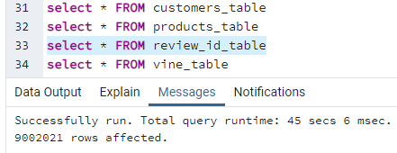

# Amazon_Vine_Analysis

## Overview of Project

### Purpose

The purpose of this project was to analyze Amazon reviews written by members of the paid Amazon Vine program.  The analysis was focused on the following reviews dataset: https://s3.amazonaws.com/amazon-reviews-pds/tsv/amazon_reviews_us_Wireless_v1_00.tsv.gz

## Results

### Tables used for analysis

A total of 4 tables were generated for analysis:
1. A "review table" that had information review_id, customer_id, product_id, product_parent and review_date on 9002021 records.

2. A "customers table" that had information on customer_id and customer_count on 5197905 records.

3. A "products table" that had information on product_id and product_title on 906592 records.

4. A Vine table that had information on review_id, star_rating, helpful_votes, total_votes, and verified_purchase on 9002021 records

### Analysis results of reviews written by  paid and non-paid customers 

The total numbers of reviewers and of 5-stars reviews were calculated:

1. A total of 253 reviews were submitted by paying customers.  Of these 103 were reviews rated with 5-stars.  Therefore the percentage of reviews with 5-stars from paying customers was: 40.7%

2. A total of 17,242 reviews were submitted by non-paying customers.  Of these 8763 were reviews that rated the purchased product 5-stars. Therefore, the percentage of reviews with 5-stars written by non-paying customers was 50.8%.

## Summary

### Bias Analysis
It is difficult to conclude from the available data if there was any bias since the number of reviews for paying customers is surprisingly small compared to that of non-paying customers (253 compared to 17,242).  
However, given that the percentage of 5-star ratings was lower for paying customers (40.7%) than for non-paying customers (50.8%), if there was bias it was likely not "sponsored" by Amazon.

### Suggested Additional Analysis 

To better understand if there was any bias, we could further segment the dataset so that the number of reviews from paying and non-paying customers was about the same.  This could be done for example by looking at reviews of a specific product (rather than a class of products) or by only considering reviews written during a shorter time span.